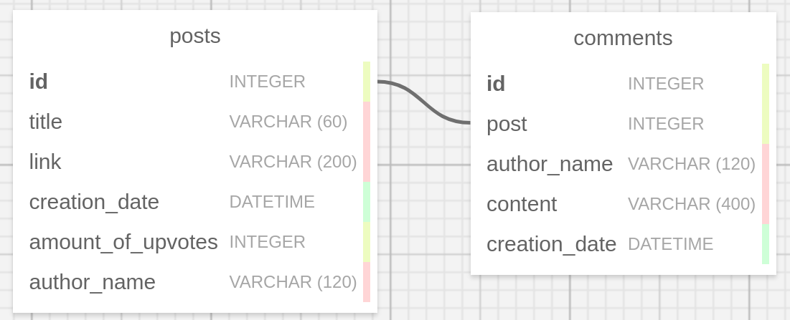

# NewsBoard

## Project structure

- Service backend runs with DRF and uwsgi server in docker container
- Postgres database runs separately in heroku
- Background celery worker can be run optionally with bash script

Service provide API to control post and comments entities with 
crud operations 

All available routes you can see in postman collections

Note:
Service has daily task to reset upvotes in the posts,
but it doesn't run in production version due to problems with heroku
deployment. But you can run it locally, instruction can be found below

## Database scheme

## Postman collection link
https://documenter.getpostman.com/view/8934060/T1DqebhS

## Heroku app 
https://agile-waters-86690.herokuapp.com/api/v1/post/
(heroku app loads around 2 minutes)

## To run in docker container:

1) Clone this repository
2) In root repository NewsBoard run command:
- sudo docker-compose up --build

Ctrl + c to gracefully stop container

## To run daily task worker:
Note: you probably need linux os to run this
1) You need to have a running instance of redis at the port 6379
2) In root repository NewsBoard run command:
- bash bg_worker.sh

Ctrl + c to gracefully stop worker
